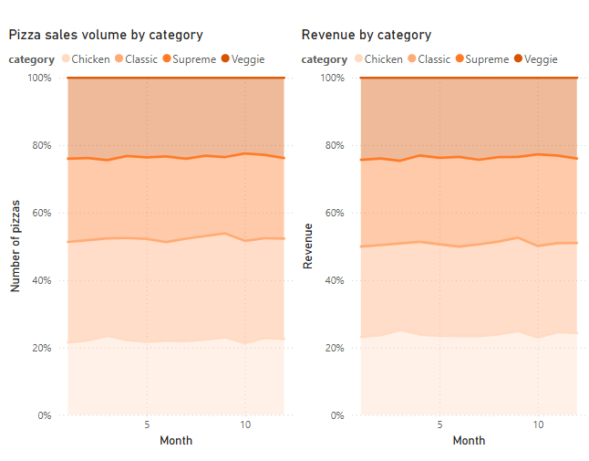
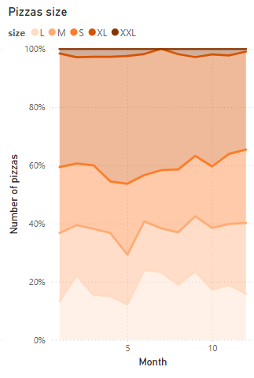
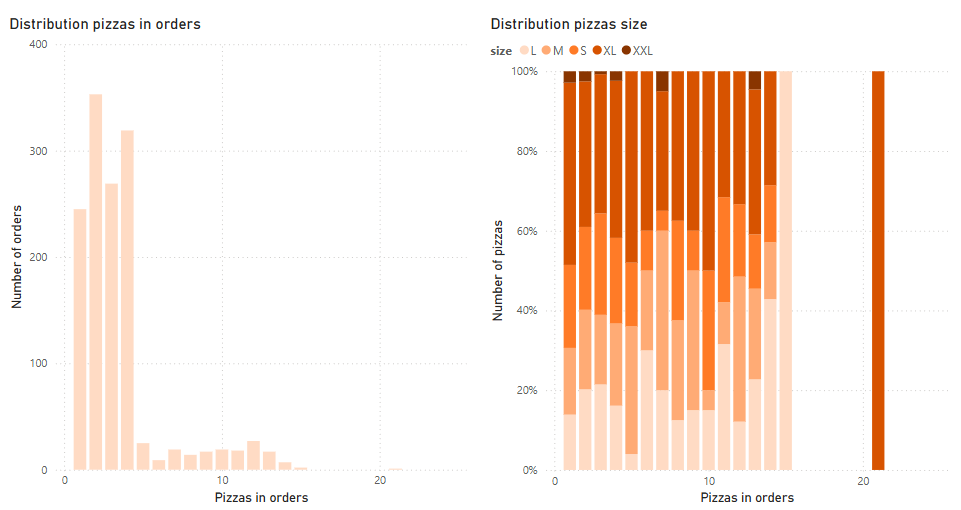

# Pizza sales analysis 

Dataset about the sales of a fictional US pizzeria throughout the year 2015.

## Summary

The pizzeria is open from Monday to Sunday. It offers 32 different pizzas divided into 4 categories
(classic, chicken, supreme, and veggie) and in 3 different sizes (S, M, L), 
with one pizza (The Greek Pizza) also available in sizes XL and XXL. Data source [here](https://vincentarelbundock.github.io/Rdatasets/doc/gt/pizzaplace.html)

  
   
  <em>ER diagram</em>

## Insights Deep-Dive
### KPIs
* In 2015, the total revenue was 801k USD from 21k orders.
* The average order included 2.2 pizzas and cost 37.5 USD.
* In terms of revenue, the most successful pizza was the Thai Chicken Pizza (42,322 USD) with 2,315 pieces sold.
* The least successful pizza, both in terms of revenue and units sold, was The Brie Carre Pizza (11,352 USD) with only 480 pieces sold.

### Sales Trends and Growth Rates
* The weakest month was February, with revenue of 64,067 USD and 1,685 orders (38 USD per order).
* The best month in terms of number of orders was August, with revenue of 71,027 USD and 1,935 orders (36.7 USD per order).
* In terms of revenue, the strongest month was July (71,027 USD), and the weakest was October (62,566 USD). The weak result in October was caused by 4 days with no sales, likely due to the store being closed.
* Besides October (4 days), the pizzeria was also closed for 2 days in September and 1 day in December.
* In terms of average order value, the weakest month was August (a drop of -5.4% compared to November).

    <em>Sales trends</em> 

### Pizza Category Performance
* The most sold category is Classic, which accounts for approximately 30% of sales, while the remaining categories are almost evenly distributed across the other 70%. In terms of revenue, the distribution is nearly balanced.

    <em>Pizza category performance</em> 

 

* Regarding size, the most popular one is L, consistently holding around 38% of sales.
* Since XL and XXL sizes are only available for The Greek Pizza, comparisons should focus solely on that pizza. In this case, there is a noticeable increase in demand for the XL size, where the popularity of size L drops to between 14% and 23%, while XL dominates with demand ranging from 33% to 43%.

  <table style="border-collapse: collapse; border: none;">
    <tr>
      <td align="center">
        
         
        <em>Pizza size distribution</em>
      </td>
      <td align="center">
        
         
        <em>Greek pizza size distribution</em>
      </td>
    </tr>
  </table>

    <em>Number of pizzas per order </em> 

 

    <em>Number of Greek pizzas per order</em> 

 

### Time Trends
* The distribution of orders throughout the workweek clearly shows a peak around lunchtime between 11 AM and 1 PM, followed by a second peak during dinnertime around 5 PM to 6 PM.
* On weekends, the graph is flatter, with no clear peak around noon, as many people tend to eat at home.
* The highest order volume is on Friday (3,538), while the lowest is on Sunday (2,624), which is a decrease of 25.8%.

    <em>Monday order distribution</em> 

 

    <em>Sunday order distribution</em> 

 

### Ingredient Usage
*The data do not contain the exact composition of the pizzas, only a list of ingredients. If a pizza contains onion and pepper, both will be marked as 1, 
and the relative amount of ingredients is adjusted according to a size coefficient, which was estimated based on the price differences between pizza sizes. 
For example, a small (S) Hawaiian pizza contains 1x pineapple, while a large (L) Hawaiian pizza contains 1.6x pineapple. If the composition of one size is known, the composition of other sizes can be calculated by multiplying by this size coefficient.*

* The most used ingredient is garlic, which appears in 20 pizzas.
* The top 5 least used ingredients are dominated by those found in The Brie Carre pizza.

    <em>The top 5 ingredients</em> 

 

    <em>The bottom 5 ingredients</em> 

 

## Recommendations
### Satisfy the demand for XL pizzas
* I assume that the margin increases or at least remains the same with larger pizza sizes.
* Data shows that, at least for the Greek pizza, demand for the XL size has increased, and this growth did not come at the expense of overall order size. Therefore, it may be worth considering adding an XL option for the best-selling pizza types.

### Increase awareness of low-selling pizzas
* Unusual flavors can differentiate the pizzeria from others, so I wouldn’t remove the low-selling ones.
* Customers might be reluctant to experiment, so it could be a good idea to include low-selling pizzas as a bonus in larger orders — for example, a "buy 3, get 1 free" offer.
* The effect could be measured indirectly through demand increase and hypothesis testing, or more effectively through some form of loyalty program (e.g. sticker cards, a certain number of online orders, etc.).

### Add drinks to the menu
* Drinks are a good way to increase the number of items per order.
* They can also be used to create “value deals” ([Quantity Discount Bias](https://www.investopedia.com/terms/q/quantity-discount.asp)), such as a lunch combo with an XL pizza and a beer for just $30.

### Boost weekend sales
* Weekend sales are significantly lower, mainly due to the lack of a strong lunchtime peak.
* It would make sense to test the above-mentioned ideas primarily on Sundays, which are the weakest day of the week.

